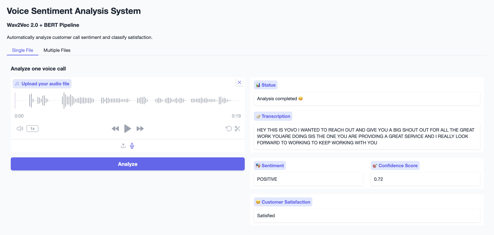

# Voice Sentiment Analysis System

<div align="center">
  
</div>

## Quick Installation

```bash
pip install -r requirements.txt
```

## Project Structure

```
voice-sentiment-project/
├── requirements.txt           # Dependencies
├── voice_sentiment.py         # Core analyzer class
├── app.py                     # Gradio web interface  
├── main.py                    # CLI interface
├── utils.py                   # Utility functions and CSS styling
├── calls/                     # Your audio files
│   ├── call1.wav
│   ├── call2.mp3
│   └── ...
└── analysis_results.csv       # Generated results
```

## Usage

### 1. Web Interface (Recommended)

```bash
python app.py
```

Opens a web browser interface at `http://localhost:7860`

### 2. Command Line Interface

```bash
python main.py
```

### 3. Direct Code Usage

```python
from voice_sentiment import VoiceSentimentAnalyzer

# Initialize
analyzer = VoiceSentimentAnalyzer()

# Analyze one call
result = analyzer.analyze_call("call1.wav")
print(result)

# Analyze multiple calls
results = analyzer.analyze_batch("calls/")
```

## Example Output

```python
{
    'file': 'call1.wav',
    'transcription': 'Hello I am very satisfied with your service',
    'sentiment': 'POSITIVE', 
    'score': 0.89,
    'satisfaction': 'Satisfied'
}
```

## Supported Audio Formats

### **Fully Supported**
- **WAV** (.wav) - *Recommended for best quality*
- **MP3** (.mp3) - *Most common format*
- **M4A** (.m4a) - *Apple audio format*

### **Audio Specifications**
- **Sample Rate**: Automatically converted to 16kHz
- **Channels**: Mono or Stereo (converted to mono)
- **Duration**: 5 seconds to 10 minutes (optimal: 30 seconds - 2 minutes)
- **Quality**: Clear speech, minimal background noise recommended

### **Not Supported**
- Video files (MP4, AVI, MOV, etc.)
- Other audio formats (FLAC, OGG, etc.) - *may work but not guaranteed*
- Extremely low quality or heavily distorted audio
- Files with encryption or DRM protection

### 💡 **Audio Quality Tips**
- Use WAV format for highest accuracy
- Ensure clear speech recording
- Minimize background noise
- Optimal recording: 16kHz, 16-bit, mono
- Test with short samples first

## Simple Workflow

```
Audio File → Transcription (Wav2Vec2) → Sentiment (BERT) → Classification
```

Perfect for analyzing customer call sentiment quickly and easily!